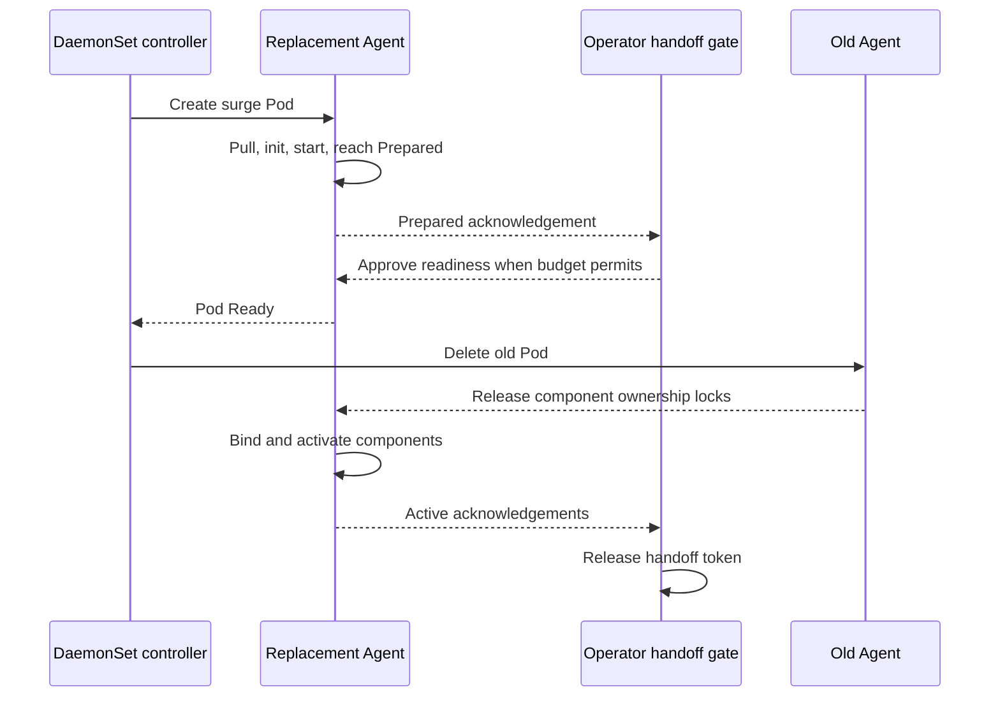

# Appendix: Prepared per-node Agent rollout investigation

This appendix contains the detailed constraints, protocol proposal, alternative
analysis, failure modes, validation plan, and source material for
[RFC: Prepared per-node Agent rollouts](agent_zero_gap_rollouts_rfc.md).

- Status: Draft
- Last updated: 2026-07-22
- Owners: Agent and Datadog Operator
- Scope: Linux Kubernetes node Agent

## Summary

The Agent should normally prepare its replacement on each node before the old
Agent is terminated. A failed or slow image pull, initialization, or process
startup must leave the old Agent running unless the explicitly enabled resource
fallback has already deleted it. We must retain `hostNetwork: true` where it is
configured and support the host ports, Unix domain sockets (UDS), host paths,
log state, and kernel resources used by production installations.

The leading design combines native DaemonSet surge with an Agent prepared mode:

1. The Operator renders `maxSurge` and `maxUnavailable: 0`.
2. Kubernetes schedules the replacement beside the old Pod and completes image
   pulls and init containers.
3. The new Agent processes start in a prepared state. They validate as much as
   possible but do not bind shared ports, bind or unlink shared UDS paths, tail
   logs, run checks, or acquire exclusive kernel resources.
4. Prepared processes report process health through container-local exec probes.
   An Operator-controlled readiness gate admits only a bounded set of prepared
   Pods to become Ready, allowing the DaemonSet controller to terminate those old
   Pods.
5. Each old component releases a node-local ownership lock only after it has
   stopped using its shared resources. Its prepared replacement acquires that
   lock and activates.
6. The replacement reports Active. Only then may the Operator admit another
   prepared replacement into the handoff budget.

This design intentionally separates Kubernetes scheduling compatibility from
runtime ownership. Removing PodSpec port declarations lets two host-network Pods
be scheduled on one node; it does not let two processes bind the same address.
The prepared state is what prevents the runtime collision.

The surge Pod normally needs a second full set of CPU and memory requests. When
that capacity is unavailable, an optional Operator fallback can classify the new
Pod as blocked only by node CPU or memory and estimate that deleting the old Pod
would make it fit. It then deletes the old Pod within the existing
`maxUnavailable` budget. This preserves rollout progress, but explicitly falls
back to the current availability behavior on those nodes and does not reserve
the freed capacity.

This RFC recommends continuing the prepared native-surge prototype. A stable
per-node endpoint holder is a credible alternative if preserving UDS inodes or
long-lived connections is required. A different Pod must not hold the Agent's
resource requests: Kubernetes scheduling, QoS, and cgroup protection attach
those requests to the holder, not to the Agent. OpenKruise should be evaluated
both for Standard surge controls and, separately, for in-place updates, but
neither removes the need for Agent lifecycle work.

## Status of the current PoC

Three coordinated experimental branches implement the first testable slice.
The Agent branch adds a pre-start `flock` gate and atomic
`prepared`/`activating`/`active`/`stopped` state for core and trace, with
additional wiring under test for process and system-probe. The health listener
is moved out of graph construction so Prepared does not bind port 5555.

The Operator branch:

- uses `experimental.agent.datadoghq.com/host-network-surge-prepared=true` as
  the explicit opt-in and otherwise leaves native surge unchanged;
- performs a conventional `arm` rollout before emitting a `standby` surge
  revision, recording phase on the PodTemplate for restart safety;
- accepts only optimized Linux `agent` + `trace-agent` and the standard
  `init-volume` + `init-config` init containers in the first pilot;
- keeps `hostNetwork: true`, narrows known profile anti-affinity while arming,
  bypasses `trace-loader`, and strips port declarations only in standby;
- replaces every regular-container startup, liveness, and readiness probe with
  an exec check of that container's private state file;
- treats `ContainerStatus.Started=true` as proof of Prepared, persists a token
  on the replacement, and UID-precondition deletes the old Pod within the
  existing `maxUnavailable` budget; and
- keeps CPU/memory resource fallback behind the separate, default-off
  `experimental.agent.datadoghq.com/resource-fallback=true` annotation.

The ops branch reserves one small experimental cluster, disables Emissary and
all containers outside the first allowlist, and caps the budget at one. Unit,
render, cache-transform, and controller tests cover the phase transition,
fail-closed rendering, local probes, token reservation, and old-UID deletion.
Real image builds and cluster data-plane validation remain outstanding; none of
these annotations are a supported production API.

## Goals

- Start replacement containers and Agent processes before terminating their old
  counterparts.
- Leave the old Agent running indefinitely when the replacement image cannot be
  pulled or the replacement cannot reach the prepared state.
- Preserve `hostNetwork: true` and existing node-facing port numbers.
- Support APM, DogStatsD, OTLP, UDS, logs, checks, system-probe, and other
  enabled Agent containers without two active collectors on one node.
- Bound both preparation and post-delete activation concurrency with the
  existing `maxUnavailable` policy rather than introducing a fixed percentage.
- Make capacity fallback explicit, conservative, observable, and optional.
- Support image, configuration, and resource changes.
- Fail closed when the Operator or Agent cannot prove that overlap is safe.

## Non-goals

- Image pre-pulling as the availability mechanism. It improves latency but does
  not protect against pull, initialization, or process failures.
- Running two active Agents on one node.
- Eliminating the final release/acquire/bind activation interval in this phase.
  Strict endpoint continuity requires a stable holder, socket activation, or
  file-descriptor handoff.
- Hiding real CPU or memory use from the scheduler.
- Replacing `hostNetwork` or host-facing ingestion endpoints as a prerequisite.
- Designing the final public Operator API before the lifecycle works in a real
  cluster.
- Guaranteeing gap-free handoff on a node where the configured policy permits
  the resource fallback to delete the old Agent.

## Terminology and invariants

An Agent component is in one of these states:

- **Starting**: the container or process has not completed safe initialization.
- **Prepared**: the process is running and healthy but owns no active node-wide
  resources.
- **Active**: the process owns its required listeners, sockets, collectors, log
  state, or kernel resources and performs its normal work.
- **Draining**: the process is terminating while it still owns some resources.

The hard invariant is that at most one instance owns each node-wide resource
group. The phase-one availability target is to remove image pull, init, and
process startup from the downtime window. Lock release followed by acquisition
and endpoint binding still has a residual interval with no Active owner. The
interval must be measured and bounded operationally; strict zero-gap continuity
requires an endpoint holder, socket activation, or file-descriptor transfer.

Prepared is not the same as Active. Kubernetes Pod Ready must temporarily mean
"safe for the old revision to terminate" for a surged replacement. Metrics and
status must expose Prepared and Active separately so users do not mistake two
Ready Pods for two active Agents.

The resource fallback is a larger explicit exception. With fallback disabled,
an unschedulable replacement leaves the old Agent active and the rollout
stalled. With fallback enabled, availability on selected nodes may match the
current delete-first rollout while the number of handoffs remains within the
configured budget. The current PoC does not have a separate fallback opt-in and
must gain one before production evaluation.

## Baseline behavior

The current delete-first lifecycle is:

1. Kubernetes marks the old Pod for deletion.
2. Its containers terminate. A slow system-probe teardown can keep the whole
   Pod Terminating after sibling Agent containers have exited.
3. Kubernetes creates and schedules the replacement.
4. The node pulls images.
5. Init containers run and the Agent processes start.

The telemetry gap contains scheduling, image pulling, initialization, and
process startup. A bad image can extend it indefinitely. Pre-pulling only
removes part of step 4 in the successful case.

Native DaemonSet surge reverses the destructive part of this order. With
`maxSurge > 0`, Kubernetes creates a new Pod on a node that still has an old,
available Pod. It marks the old Pod for deletion only after the new Pod is Ready
for `minReadySeconds`. A Pending, image-pull-failing, or unready replacement
therefore leaves the old Pod running.

Native surge does not bound the complete handoff. Once an old Pod has a deletion
timestamp, the DaemonSet controller stops counting that old/new pair against
`maxSurge`, even if the old containers are still draining and the replacement
has not become Active. A merely Prepared-and-Ready replacement can therefore
release a slot and let the controller advance across the cluster. An external
Active acknowledgement and admission gate are required to keep post-delete
handoffs within budget.

If an old Pod becomes unavailable, the DaemonSet controller may create its
replacement without charging that node to the normal surge limit. Capacity and
observability must therefore tolerate more overlap than the healthy-rollout
`maxSurge` value during simultaneous failures.

## Constraints

### Host networking and ports

`hostNetwork: true` puts both Pods in the same node network namespace. In
addition, Kubernetes defaults every declared `containerPort` to the same
`hostPort` for a host-network Pod. The scheduler's host-port filter then rejects
the second Pod before either process starts.

Disabling only Datadog's `hostPortConfig` is insufficient because other
container port declarations may remain. The prepared template must omit the
entire `ports:` list from every regular and init container. PodSpec port entries
are metadata and scheduling declarations; a process can still bind the numeric
node port at runtime.

Omitting the declarations solves only scheduling. If the prepared process calls
`bind(2)` on the production address while the old process is listening, one of
the processes still fails. The replacement must remain non-listening until it
owns the corresponding resource group.

Network probes are also unsafe during overlap. Both host-network Pods have the
same Pod IP, so an HTTP or TCP probe directed at the replacement's numeric port
can reach the old Agent and falsely report the replacement healthy. Prepared
mode must use exec probes or another container-private health channel. Named
port references cannot survive removal of the `ports:` declarations and must
fail validation or be rewritten.

Services and NetworkPolicies using numeric ports continue to describe the same
runtime ports. Any external object using a named target port must be detected
where possible and documented as incompatible. The Operator cannot discover
every externally managed object from a DaemonSet template.

### Shared UDS paths

Mounting the same hostPath into two Pods is allowed. The conflict is caused by
two processes binding, unlinking, or cleaning up the same socket pathname.
Prepared processes must not touch the production UDS path.

A Unix socket connection refers to a kernel socket object, commonly described
by the filesystem device and inode associated with its bound pathname. If one
process unlinks the path and another binds the same path, the new pathname names
a new socket object. Existing connected clients remain attached to the old
object until it closes; new clients resolve the new object. Stream clients will
normally observe EOF or reset when the old server exits and must reconnect.
Connected datagram behavior and retry policy must be measured for supported
clients.

Prepared surge has the same eventual rebind as the baseline, but it avoids
rebinding while the old server is live. It is therefore no worse than the
baseline for inode continuity, but it does not preserve the inode across the
handoff. A stable endpoint holder can preserve it.

### Active collectors and host resources

Ports and UDS are only the scheduler-visible conflicts. A second active Agent
can also duplicate checks, tail the same logs, race on registry or offset state,
attach duplicate eBPF programs, or contend for system-probe and security
resources. Each component needs an explicit prepared boundary; a generic
"ports are free" test is not enough.

The ownership boundary should be per component or per tightly coupled resource
group. A Pod-wide gate would keep every replacement component asleep until the
slowest old container exits. With per-component gates, a new trace-agent can
activate after the old trace-agent exits while a new system-probe continues to
wait through a long old system-probe teardown.

### Resource requests

The scheduler sums the requests of the old and replacement Pods during surge.
The Kubernetes DaemonSet API explicitly warns that per-node DaemonSet resource
consumption can double. This is correct accounting: both Pods exist and both
can consume memory and CPU during preparation or a fault.

Limits do not solve scheduling because scheduling is based on requests. Lowering
only the prepared Pod's request would under-account its real use and weaken its
QoS and eviction protection. Kubernetes does not provide a general primitive
that lends a CPU or memory request from one Pod to another.

## Proposed design

### 1. Explicit capability gate

Prepared surge remains opt-in until every enabled regular and init container
supports the protocol. The Operator must validate both the requested strategy
and image capabilities before it removes port declarations or relaxes
anti-affinity.

A safe bootstrap is a one-time conventional rollout to an Agent version that
participates in ownership locks even when prepared surge is disabled. Prepared
surge can then be enabled for the next update. Custom images need an explicit
capability declaration or a runtime handshake; version-string guesses are not
sufficient.

If validation fails, the Operator leaves the ordinary template unchanged,
reports a status condition and warning event, and does not claim surge safety.

Every production init container must be enumerated and audited because it runs
while the old Agent is Active. An init container may prepare private files, but
it must not mutate shared UDS paths, shared log state, host permissions, kernel
state, or other node-wide resources. Exclusive work must move into the
post-ownership activation phase. Unknown or user-supplied init containers fail
closed unless they explicitly declare a reviewed overlap capability.

### 2. Render a schedulable surge template

For an eligible native DaemonSet, the Operator:

- keeps `hostNetwork: true`;
- removes all container and init-container `ports:` declarations;
- rewrites every supported HTTP or TCP startup, readiness, liveness, and
  lifecycle check as a container-local exec operation;
- rejects every network probe or hook it cannot rewrite, whether its port is
  numeric or named;
- permits only the known DatadogAgentProfile anti-affinity transformation;
- emits `maxUnavailable: 0`; and
- uses the user's existing `maxUnavailable` value as both `maxSurge` and the
  Operator handoff budget. The resource fallback uses the same ceiling only when
  separately enabled.

No constant rollout percentage is introduced. A value such as `1` stays `1`; a
percentage stays a percentage and is resolved against desired nodes using the
same rounding semantics as Kubernetes.

### 3. Start Agent processes in prepared mode

Image pulling and init containers finish before regular containers start. Each
enabled Agent binary then starts in a prepared mode that performs only safe
initialization. The exact boundary must be defined per component, but the
minimum contract is:

- parse configuration and secrets;
- initialize internal state that is private to the container or revision;
- verify executable dependencies and permissions where this has no side
  effects;
- expose process health through an exec-readable file or private mechanism;
- do not bind production TCP or UDP ports;
- do not bind, unlink, chmod, or clean up production UDS paths;
- do not start checks, log tailers, network collectors, or telemetry emission;
- do not acquire system-probe, eBPF, security, or other exclusive host
  resources; and
- do not mutate shared log offset or registry state.

This state should run the real Agent binary rather than a shell sleeping before
`exec`. The objective is to pay image, container, binary startup, configuration
parsing, and safe initialization costs before the old process exits.

### 4. Report handoff readiness without network probes

Every supported regular container gets a startup exec probe that accepts
`prepared`, `activating`, or `active`. Kubelet then records
`ContainerStatus.Started=true` for that exact container; a restart resets it.
Liveness accepts the same states so waiting is indefinite. Readiness accepts
only `active`, so a standby replacement is never a Service endpoint and never
looks healthy merely because the old host-network listener answers.

The Operator maintains a handoff budget derived from the user's existing
`maxUnavailable` policy. When all expected containers are Running+Started, all
expected init containers exited zero, and the old Pod remains Available on the
same node, it annotates the replacement with the old UID. That persisted
reservation charges the budget across reconcile retries and Operator restarts.
After revalidation, the Operator deletes that exact UID. No Pod readiness gate
or status write is required.

The token is charged until the replacement reaches Active/Ready. If activation
fails after deletion, no additional node is handed off once the budget is
exhausted. Native `maxSurge` may prepare another replacement, but the Operator
does not delete its old Pod.

### 5. Fence activation with node-local ownership locks

Each active component holds an exclusive kernel-backed lock on a stable file in
a shared hostPath. The lock file is never deleted or replaced. The component
itself, or a helper whose lifetime is coupled to the owned resources, holds the
file descriptor until listeners and other shared resources are released.

The prepared replacement blocks on the same lock. Once it acquires ownership it
binds production endpoints, opens shared state, initializes host collectors, and
transitions to Active. A process crash releases the advisory lock with its file
descriptor. A plain marker file is insufficient because it can be left stale.

Locks should be split where independent activation is safe, for example:

- core Agent and DogStatsD endpoints;
- trace-agent endpoints;
- process-agent collectors;
- logs and their shared state;
- system-probe and its kernel resources; and
- security-agent resources.

The exact grouping is an Agent design task. Lock acquisition alone is not a
license to unlink another process's UDS path: activation must first verify that
the path is absent or belongs to a dead owner and fail safely otherwise.

### 6. Let the Operator initiate bounded termination

A standby Pod cannot become Ready while the old process holds its lock, so
native DaemonSet readiness ordering alone would deadlock. The Operator uses the
Started statuses described above to reserve a handoff token and delete the old
Pod. The native DaemonSet controller still creates and node-targets the surge
replacement; the Operator owns only the prepared-to-termination edge.

New components activate as their old counterparts release ownership. Their
readiness exec probes acknowledge Active after listeners, collectors, and
shared state are operational. An activation failure therefore keeps the
replacement NotReady and its token charged instead of allowing the rollout to
sweep the cluster.

If the replacement never reaches Prepared because of an image, init, config, or
process problem, Kubernetes never deletes the old available Pod. The rollout
stalls, which is the required safe failure mode.

### 7. Fall back only after a conservative resource-shortage estimate

A surged replacement may remain Pending because the node cannot fit both Pods'
requests. If resource fallback is enabled, the Operator may delete the old Pod
only after all of these checks pass:

- the pending Pod is the current DaemonSet revision and targets exactly one
  node;
- the old Pod on that node is available and belongs to the previous revision;
- the scheduler reports only insufficient CPU and/or memory plus the expected
  DaemonSet node-affinity mismatch on other nodes;
- there is no nomination or deletion already in progress;
- the node is Ready, schedulable, and free of memory, disk, PID, and network
  pressure;
- the Pod uses a supported scheduler, volume, affinity, topology, host-port, and
  resource shape;
- both directions of required Pod anti-affinity are satisfied;
- recomputing scheduler requests shows the replacement does not fit before,
  but would fit in the observed snapshot after removing the exact old Pod; and
- a persistent token plus live-state recheck keeps normal approved-but-not-
  Active handoffs and fallback reserved/deleted-but-not-Active nodes within one
  unified configured budget.

The fallback token is persisted before the UID-preconditioned delete and is
released only after the replacement reports Active.

The delete uses a UID precondition. Unknown Pod-declared constraints and
unrecognized scheduler reasons fail closed. Cluster-specific plugins installed
under the default scheduler name are not discoverable through the Pod API; the
feature therefore also needs a scheduler configuration allowlist or an explicit
operational compatibility requirement. A warning event identifies the node, old
Pod, and replacement.

This is not an atomic capacity reservation. After the checks and old-Pod delete,
another workload or nominated Pod can consume the freed capacity before the
replacement binds. The Agent may then remain Pending with no old Agent, possibly
indefinitely. It may also encounter an image pull or init failure only after the
old Pod has been deleted. Priority discipline, a preemptible placeholder, a scheduler
reservation, or direct binding would be required to close that race. Until one
is selected, fallback is a best-effort progress mechanism and must be explicitly
opted into with this failure mode visible to users.

This fallback must never initially trigger for `ImagePullBackOff`, failed
readiness, bad configuration, host-port conflicts, disk or PID pressure, taints,
unknown affinity, or generic scheduling errors. Those failures leave the old
Agent running unless a prior resource fallback already deleted it.

## Failure behavior

| Failure | Expected behavior |
|---|---|
| Slow or failed image pull | Old Agent remains Active indefinitely on the normal path; after an explicit resource fallback delete, no old Agent remains. |
| Init-container failure | Old Agent remains Active indefinitely on the normal path; after an explicit resource fallback delete, no old Agent remains. |
| Agent cannot reach Prepared | Old Agent remains Active indefinitely. |
| Replacement is Prepared, old termination is slow | Prepared components wait; each activates only after its old counterpart releases ownership. |
| Normal ownership handoff | Pull, init, and process startup are already complete, but release/acquire/bind leaves a measured residual interval with no Active owner. |
| Activation fails after old exit | That node is unavailable; its handoff token remains consumed so additional nodes are not admitted. |
| Node lacks overlap CPU or memory, fallback disabled | Old Agent remains Active and rollout stalls. |
| Node lacks overlap CPU or memory, fallback enabled | Operator may delete the old Pod after a conservative fit estimate and within budget; another workload can still win the freed capacity and extend downtime. |
| Runtime port bind fails after ownership | Component remains unhealthy, does not unlink an unknown UDS, and surfaces an activation error. |
| Operator loses API connectivity | Existing Pods keep their current state; node-local ownership does not depend on a timely Operator reconcile. |
| Node or kubelet fails | Surge cannot guarantee node-local telemetry; ordinary Kubernetes node failure behavior applies. |

## Trade-offs of the leading design

### Advantages

- Uses the upstream DaemonSet controller for create-before-delete ordering.
- Keeps the old Agent through pull, initialization, and prepared-process
  failures.
- Retains `hostNetwork: true` and existing runtime port numbers.
- Does not add a permanent proxy to every telemetry path.
- Adds no cluster-wide workload controller dependency.
- Preserves honest per-Pod resource requests.
- Can activate components independently during a slow multi-container teardown.
- Handoff admission and fallback deletion counts use the policy users already
  understand.

### Costs and risks

- Requires coordinated changes across multiple Agent binaries and a new
  Operator handoff coordinator.
- Temporarily needs approximately two Pods' requests on surged nodes.
- Pod Ready has prepared semantics during handoff and needs separate Active
  observability.
- Native surge alone does not bound post-delete activation; a missing or faulty
  Active acknowledgement could stall or over-advance the rollout.
- Removing port declarations can break named target-port consumers the Operator
  cannot discover.
- Every shared host resource must be audited; an omitted side effect can create
  duplicate telemetry or host contention.
- Ownership lock bootstrap and mixed Agent versions require a deliberate
  compatibility rollout.
- The resource fallback deliberately gives up zero-gap behavior on constrained
  nodes and cannot reserve the capacity it predicts will be freed.
- Release/acquire/bind still leaves a residual no-owner interval during a normal
  handoff.
- Socket inode continuity is no better than the baseline once the old socket is
  closed and rebound.

## Alternatives

### A. Stable per-node endpoint holder

A small, rarely updated DaemonSet can own the public host-network ports and UDS
paths. Agent Pods listen on generation-specific private ports or socket paths.
The holder health-checks backends, atomically selects the active generation, and
optionally drains old connections.

This is the strongest endpoint abstraction:

- the public UDS pathname and inode can remain stable across Agent updates;
- public ports never move between Agent processes;
- TCP and HTTP connections can be drained;
- bounded UDP or stream buffering can hide a short backend restart; and
- Agents may use pod networking or unique host-network backend ports.

It is also a new node-wide data-plane dependency:

- a holder failure interrupts metrics and traces even when the Agent is healthy;
- the holder has its own difficult upgrade problem because a second holder
  cannot bind the public endpoints;
- DogStatsD UDP and datagram UDS forwarding must preserve packet boundaries and
  sender credentials or origin detection can change;
- TCP keep-alive and gRPC connections remain pinned to an old backend until
  drained or reset;
- queues require explicit bounds, backpressure, and drop telemetry;
- logs, checks, system-probe, and kernel ownership are not proxyable and still
  need prepared/active fencing; and
- adoption requires a one-time coordinated migration of endpoints from the
  Agent to the holder.

The holder is worth prototyping if UDS inode continuity, connection drain, or
brief ingestion buffering becomes a hard requirement. It is not required merely
to schedule the sleeping replacement.

### B. A holder that also owns the Agent's resource requests

This variant gives the stable holder an Agent-sized CPU and memory request and
gives Agent Pods very small or zero requests, hoping old and new Agents can share
the holder's reservation.

Reject this design. Kubernetes does not transfer requests across Pods. CPU
shares, memory protection, QoS class, quota attribution, eviction priority, and
capacity accounting apply to the holder's cgroup. The active Agent remains
under-requested, and two Agent Pods can consume memory simultaneously despite
only one being represented to the scheduler. Limits cap consumption but do not
repair placement or QoS semantics.

Endpoint ownership and expendable capacity reservation are also incompatible
lifecycles. A Pod that must be deleted or preempted to release capacity cannot
simultaneously provide stable ports and UDS.

If an endpoint holder and capacity reservation are both tested, they must be
separate workloads.

### C. Low-priority per-node surge placeholder

A separate low-priority DaemonSet can reserve one Agent-sized slot on every
node. Agent Pods have a higher PriorityClass. When a surge Pod needs capacity,
the scheduler preempts only the placeholder; after the old Agent exits, the
placeholder returns.

This preserves honest Agent requests and uses native scheduling. It also
permanently withholds enough allocatable capacity for two Agents per node, which
is the same capacity cost as guaranteeing every surge will fit. It cannot create
physical memory. Kubernetes priority is global, so another higher-priority
workload can evict the placeholder and consume the intended slot. Victim grace
period also adds delay. Deterministic headroom therefore requires cluster-wide
priority discipline and a short placeholder termination grace. This is an
operational policy option for clusters willing to pay for reserved headroom, not
a general default.

### D. Start small, then resize the replacement Pod

A custom controller could create the Prepared replacement with small CPU and
memory requests. After the old Pod exits, it could use in-place Pod resize to
raise the new Pod to the normal requests before activation.

This avoids permanent headroom and reduces scheduler overlap, but it is not an
atomic request transfer. Resize can remain `Deferred` or become `Infeasible`;
QoS class cannot change; only CPU and memory are supported; and static CPU or
memory-manager policies, Windows, and Kubernetes version or feature gates add
constraints. Until the resize succeeds, the prepared process is under-protected
and can consume more than the scheduler accounted. DaemonSet template drift and
rollback semantics also require a custom controller. Keep this as an experiment,
not an availability foundation.

### E. Dynamic Resource Allocation or a custom ResourceClaim

Dynamic Resource Allocation assigns devices or other driver-managed resources.
A custom driver could serialize a synthetic "node Agent endpoint" claim, but it
would not proxy a port, preserve a Unix socket, pass a socket file descriptor, or
reserve generic CPU and memory for another Pod. Exclusive allocation would also
block the desired Prepared Pod from being scheduled concurrently. The API and
driver footprint do not buy the lifecycle primitive this design needs.

### F. OpenKruise Advanced DaemonSet: Standard surge

OpenKruise Standard rolling update with `maxSurge` also creates the replacement
before deleting the old Pod and supports `minReadySeconds`, partition, node
selection, pause, and PreDelete lifecycle hooks.

It has the same fundamental overlap constraints as native surge:

- Kubernetes still defaults and schedules host ports;
- both Pods still share host-network and UDS namespaces;
- requests still double;
- a sleeping replacement still needs a Prepared readiness contract; and
- active collectors still need Agent fencing.

OpenKruise has no built-in resource-unschedulable fallback. Its richer rollout
and PreDelete controls may simplify an explicit handoff, so it deserves a focused
prototype, but it is an added CRD/controller/webhook/node-daemon dependency and
is not by itself the availability solution.

PreDelete is not itself a handoff-budget primitive. A Pod in OpenKruise's
pre-deleting state can stop consuming its surge slot before the hook completes,
just as a native deleting Pod does. Bounding activation still needs an external
coordinator, or carefully controlled pause and partition progression tied to an
Active acknowledgement.

### G. OpenKruise Advanced DaemonSet: `InPlaceIfPossible`

An in-place update preserves the Pod UID, node, network namespace, and mounted
volumes. It restarts changed containers while unaffected containers continue.
This avoids a second Pod, rescheduling, duplicate requests, and complete Pod
teardown. It is attractive when one Agent container changes or a long
system-probe teardown should not block an unrelated component update.

It does not overlap old and new instances of a changed container. Kubelet stops
that container before pulling and starting its new image, so a failed image pull
can leave the component down. OpenKruise image pre-download currently improves
the common case but does not gate the rollout on successful pulls.

Supported in-place changes are narrower than arbitrary Pod-template changes.
Unsupported changes under `InPlaceIfPossible` fall back to Pod recreation.
Advanced DaemonSet does not provide a fail-closed `InPlaceOnly` mode. CPU and
memory resize support also depends on Kubernetes feature support.

Treat in-place update as a complementary optimization, not the primitive that
satisfies the failed-pull invariant. Useful upstream contributions would be an
Advanced DaemonSet `InPlaceOnly` policy, a real image-pre-download success gate,
and explicit prepared/activation lifecycle support.

#### Local OpenKruise v1.9.1 result

A Kubernetes v1.36.1 Kind experiment measured one image-only update with an
uncached image and one with a standalone, successfully completed ImagePullJob.
The uncached update had a 7.845-second success-to-success request gap, including
a kubelet-reported 2.559-second pull. A different, pre-pulled image had a
4.511-second gap and was reported already present by kubelet, but retained the
container restart and readiness gap. These single runs are not a causal timing
comparison.

A failed standalone ImagePullJob left the old Pod, container ID, restart count,
image, and traffic unchanged because the DaemonSet was not mutated. In contrast,
successful pre-pull of an incompatible image was followed by exit 127 and
`CrashLoopBackOff` after activation. Adding an environment variable caused
`InPlaceIfPossible` to recreate the Pod under a new UID.

OpenKruise's automatic AdvancedDaemonSet pre-download is an alpha feature gate
that defaults off. With it enabled on a two-worker test, the controller created
an owned ImagePullJob and started an in-place update without waiting: the old
container exited two seconds after the job started while that job was still
active, and the Pod entered `ImagePullBackOff`. Exact commands, identities, and
timestamps are in `experiments/openkruise-prepull/README.md`.

### H. Endpoint holder sidecar plus OpenKruise in-place update

An endpoint holder in the same Pod can remain running while OpenKruise updates
only Agent containers. With Pod-level resources, the holder and Agent can share
one correctly scoped Pod budget, and the holder can preserve listeners during
eligible image-only updates.

This hybrid avoids the cross-Pod request problem but does not preserve endpoints
when an unsupported change recreates the Pod. It also still has no overlapping
old and new Agent process, so the holder needs buffering to mask process startup
and cannot cover logs or kernel collectors. It is a promising optimization for
specific update classes, not a universal rollout model.

### I. CSI for the shared UDS

A CSI driver can provision or mount a shared directory, choose per-Pod backing
paths, and provide mount lifecycle hooks. It cannot preserve or transfer a live
socket object, bind host-network ports, select an active Agent backend, or stop a
process from unlinking the shared pathname.

A CSI node plugin could itself own and proxy the public UDS, but then it is the
stable endpoint-holder design packaged as storage infrastructure. CSI alone does
not solve the socket ownership problem and is unnecessary for two Pods to mount
the existing hostPath.

### J. Node-local Service, CNI, or eBPF endpoint indirection

Agents can use pod networking and a node-local Service, NodePort, CNI redirect,
or eBPF program to expose stable node endpoints. This removes Pod host-port
reservations and can select an active backend.

The approach changes networking and attribution semantics. UDP source identity,
DogStatsD origin detection, host reachability, NetworkPolicy behavior, and
support across customer CNIs must be validated. It does not solve UDS, logs, or
kernel ownership. It may be appropriate for a controlled internal environment
but is a larger compatibility change than prepared host-network surge.

### K. `SO_REUSEPORT`

Linux `SO_REUSEPORT` can allow multiple processes to bind the same TCP or UDP
address after scheduler reservations are removed. The kernel distributes flows
or datagrams between listeners; it does not provide the required active/passive
ownership. A privileged eBPF reuseport selector could implement selection, but
that is another endpoint-indirection data plane, is Linux-specific, and does
nothing for filesystem UDS paths, logs, or kernel collectors. It is not a
general handoff mechanism.

### L. Two DaemonSets or a custom per-node rollout controller

The Operator can manage old and new DaemonSets, or a new controller can create
one replacement Pod per selected node and coordinate explicit handoffs.
This offers full state-machine control, including scheduling timeouts and
resource fallback.

It recreates substantial logic already present in the native DaemonSet
controller, increases API objects and reconciliation state, and still requires
the same prepared Agent behavior for ports, UDS, and active collectors. It is
justified only if native readiness-driven ordering cannot express the required
handoff.

### M. Image pre-pull only

An ImagePullJob, pre-pull DaemonSet, or runtime cache warmer reduces successful
rollout time. It does not keep the old process through initialization or startup,
does not guarantee that every layer remains present, and does not solve a bad
config or failed process. Keep it as an optional performance optimization.

### N. In-Agent supervisor, socket activation, or file-descriptor transfer

A long-lived supervisor can own listeners, download or select versioned Agent
binaries, launch a new child, and pass file descriptors with socket activation.
This can provide the most exact handoff and preserve socket objects.

It moves image and process lifecycle outside ordinary Kubernetes container
semantics, complicating supply-chain policy, rollback, observability, and
resource isolation. A stable holder that runs as an explicit container is easier
to reason about. Keep this as a long-term Agent architecture option.

## Decision matrix

| Option | Old survives failed pull | New process starts first | Stable public endpoints | Request model | Change coverage | Complexity |
|---|---:|---:|---:|---|---|---|
| Current delete-first | No | No | No | One Pod | All template changes | Low |
| Image pre-pull only | Only before rollout | No | No | One Pod | Images | Low |
| Native surge + prepared Agent + handoff gate | Normal path | Yes | Same address/path, rebound at activation | Honest; temporarily two Pods | All Pod replacements | High |
| Stable endpoint holder + prepared Agents | Yes | Yes | Yes while holder lives | Honest; two Agents plus holder | All Agent replacements | High |
| Holder also owns Agent requests | Superficially | Yes | Yes | Incorrect cross-Pod accounting | All Agent replacements | Reject |
| Per-node placeholder + native surge | Yes | Yes | Same as prepared surge | Honest; permanently reserves overlap capacity | All Pod replacements | Medium/high cost |
| Small request then in-place resize | Conditional on resize | Yes | Same as prepared surge | Temporarily under-requested | CPU/memory and version dependent | High/experimental |
| OpenKruise Standard + prepared Agent | Yes | Yes | Same as native surge | Honest; temporarily two Pods | All Pod replacements | High dependency cost |
| OpenKruise in-place | No pull guarantee | No for changed container | Pod namespace persists | Honest; one Pod | Supported fields only; otherwise recreate | Medium/high |
| CSI alone | No | No | No | Unchanged | UDS mount lifecycle only | No useful solution alone |
| `SO_REUSEPORT` | Conditional | Yes | TCP/UDP only | Honest; temporarily two Pods | Does not provide active/passive handoff | Reject alone |
| Custom rollout controller + prepared Agent | Yes | Yes | Same as selected endpoint design | Honest; temporarily two Pods | All controlled changes | Very high |

## Recommendation

Continue with native DaemonSet surge, Agent prepared mode, and an
Active-acknowledged Operator handoff gate as the leading design because it
directly addresses the dominant delay without adding a permanent data-plane hop.
The small scheduler-compatibility PoC is implemented; the lifecycle and
coordinator are substantial, unimplemented work.

Retain the current resource-fit classification logic, but place deletion behind
a separate explicit opt-in. Treat it as a best-effort, non-zero-gap escape hatch
for constrained nodes until capacity can be reserved atomically.

Prototype two alternatives in parallel at small scope:

1. OpenKruise `InPlaceIfPossible` for image-only and selected-container updates,
   measuring the remaining restart gap and failed-pull behavior.
2. A minimal endpoint holder for DogStatsD UDP, APM TCP/HTTP, and stream/datagram
   UDS, measuring origin metadata, connection drain, buffering, and inode
   continuity.

Do not move Agent requests to a different holder Pod. Evaluate the placeholder
DaemonSet only as an opt-in capacity policy for clusters willing to reserve
surge headroom permanently.

## Security and operability

Removing PodSpec port declarations does not reduce the privileges of a
host-network container. It only removes scheduler-visible reservations and API
metadata. Existing host-network, hostPath, kernel, and packet-capture risks
remain and should be documented independently.

Prepared mode should reduce privileges before activation where practical, but a
single container cannot generally gain new Linux capabilities after startup.
The design must therefore treat the prepared process as privileged even while it
is sleeping and minimize its side effects.

Ownership files require a root-owned host directory and stable permissions. A
lock key must identify the actual node-wide resource, such as protocol, address,
port, canonical UDS path, or kernel facility. Two installations cannot use
different lock keys to claim the same endpoint. Installation identity remains
useful for authorization and diagnostics, but not for weakening mutual
exclusion. Processes must not follow untrusted symlinks or replace lock files.
Endpoint holders require equivalent or greater hardening because they receive
all node-local telemetry and may preserve sender credentials.

Mixed versions, rollback, node reboot, force deletion, kubelet restart, and
container-runtime cleanup need explicit tests. The safest response to an unknown
owner is to remain Prepared and report a blocking condition.

## Observability

The Operator and Agent should expose, per node and component:

- rollout revision and old/replacement Pod UIDs;
- Starting, Prepared, Active, Draining, and fallback states;
- time spent pulling, initializing, prepared, waiting for ownership, activating,
  and draining;
- ownership acquisition and release events;
- port or UDS bind failures and observed socket inode generation;
- resource-fallback candidates, reservations, deletions, and rejected reasons;
- active generation selected by an endpoint holder, if used;
- packets, requests, bytes, connections, queue depth, drops, and metadata loss
  through a holder; and
- a per-node owner gauge that always alerts on multiple active owners and records
  the duration of every zero-owner interval against the selected availability
  policy.

Pod Ready alone is not sufficient rollout telemetry.

## Validation plan

### Fast lab

Use a two-worker Linux Kind cluster or KindVM and short teardown delays while
iterating. Docker Desktop is no longer available on the current workstation, so
local validation requires another container runtime or a remote Linux lab.

Establish these baselines:

1. Measure the current delete-first gap.
2. Show native surge works without host-network port reservations.
3. Show ordinary production `hostNetwork` plus declared ports blocks the second
   Pod.
4. Show the prepared rendered template schedules two Pods while retaining
   `hostNetwork: true`.
5. Reproduce a false-positive replacement probe against the old Agent's numeric
   host-network health port, then show exec probes remove the alias.
6. Audit and exercise every production init container while the old Pod remains
   Active.
7. Show a replacement that binds or unlinks production endpoints before
   activation fails the safety tests.

### Hypothesis-driven prototypes

Run only the tests needed for the current question:

- prepared Agent processes report Prepared without binding production
  endpoints, while the unapproved Pod remains NotReady;
- the handoff coordinator approves no more than its budget and does not release
  a token until all replacement components acknowledge Active;
- a long Terminating Pod cannot let the rollout accumulate unbounded handoffs;
- exec probes cannot accidentally interrogate the old host-network process;
- per-component locks allow trace/core activation while old system-probe still
  drains;
- the Operator classifies only CPU or memory shortage, and a competing Pod test
  demonstrates the non-atomic fallback race;
- the minimal endpoint holder preserves or intentionally translates source
  metadata; and
- OpenKruise Standard and in-place strategies exhibit the documented failure
  behavior.

### Final validation for the leading design

Use production Agent configuration and shared host resources. Generate numbered
signals so omissions and duplicates are visible:

- DogStatsD metrics over UDP and UDS;
- APM traces over TCP/HTTP and supported UDS transports;
- OTLP gRPC and HTTP traffic;
- numbered log lines with restart and rotation cases;
- checks and process/network/security telemetry relevant to enabled components;
  and
- long-lived and reconnecting socket clients.

Exercise:

- slow and failed image pulls;
- bad image references;
- init, configuration, startup, readiness, and activation failures;
- insufficient CPU, memory, pod count, and disk space;
- fallback enabled and disabled;
- image-only, configuration, resource, and mixed updates;
- Operator and API-server interruption;
- kubelet/container-runtime restart and Pod force deletion;
- rollback and mixed prepared-capable versions; and
- one real two-minute system-probe teardown while sibling containers exit.

Pass phase one only if multiple Active owners are never observed, handoff and
fallback concurrency remain within their budgets, and every zero-owner interval
is attributable to the measured activation boundary or the explicitly enabled
fallback—not image pull, init, or prepared-process startup. Report numbered
metric, log, and trace omissions or duplicates rather than hiding them behind a
binary pass result. Strict zero-gap acceptance requires the endpoint-holder or
socket-handoff variant to demonstrate no zero-owner interval. Repeat the result
on Linux KindVM and an experimental cluster before defining a public Operator
API.

## Open questions

- Which initialization steps can each Agent binary safely complete before
  activation?
- What are the correct ownership groups for core Agent, trace-agent, logs,
  process-agent, system-probe, and security-agent?
- Can every network probe be replaced with a reliable exec probe without
  changing existing health semantics?
- How should an active process prove a UDS pathname is safe to unlink after an
  abnormal old-process exit?
- Which supported clients reconnect from old stream and datagram UDS socket
  objects, and on what retry schedule?
- Do any internal or external Services rely on named Agent target ports?
- Is a one-time conventional bootstrap rollout acceptable, or must the first
  prepared rollout interoperate with an old Agent that does not hold locks?
- Which configuration and resource changes can OpenKruise update in place for
  the production multi-container Agent Pod?
- Is UDS inode continuity valuable enough to justify a permanent endpoint
  holder?
- What authenticated status channel should carry Prepared, handoff-approved,
  and per-component Active acknowledgements?

## References

- [Kubernetes `RollingUpdateDaemonSet` API](https://github.com/kubernetes/api/blob/v0.35.3/apps/v1/types.go#L609-L646)
- [Kubernetes host-network port defaulting](https://github.com/kubernetes/kubernetes/blob/v1.35.3/pkg/apis/core/v1/defaults.go#L396-L405)
- [Kubernetes scheduler host-port filter](https://github.com/kubernetes/kubernetes/blob/v1.35.3/pkg/scheduler/framework/plugins/nodeports/node_ports.go)
- [Kubernetes DaemonSet rolling-update implementation](https://github.com/kubernetes/kubernetes/blob/v1.35.3/pkg/controller/daemon/update.go)
- [Kubernetes DaemonSet per-node Pod management](https://github.com/kubernetes/kubernetes/blob/v1.35.3/pkg/controller/daemon/daemon_controller.go)
- [Kubernetes DaemonSet surge KEP](https://github.com/kubernetes/enhancements/tree/master/keps/sig-apps/1591-daemonset-surge)
- [Kubernetes Pod resource management](https://kubernetes.io/docs/concepts/configuration/manage-resources-containers/)
- [Kubernetes Pod priority and preemption](https://kubernetes.io/docs/concepts/scheduling-eviction/pod-priority-preemption/)
- [Kubernetes in-place Pod resize](https://kubernetes.io/docs/tasks/configure-pod-container/resize-container-resources/)
- [Kubernetes Dynamic Resource Allocation](https://kubernetes.io/docs/concepts/scheduling-eviction/dynamic-resource-allocation/)
- [Kubernetes Service traffic policy](https://kubernetes.io/docs/concepts/services-networking/service-traffic-policy/)
- [Kubernetes CSI volumes](https://kubernetes.io/docs/concepts/storage/volumes/#csi)
- [OpenKruise v1.9 Advanced DaemonSet](https://github.com/openkruise/openkruise.io/blob/55e5c2228ac27026ced2ff1ec5384966cd59e71e/versioned_docs/version-v1.9/user-manuals/advanceddaemonset.md)
- [OpenKruise in-place update semantics](https://github.com/openkruise/openkruise.io/blob/55e5c2228ac27026ced2ff1ec5384966cd59e71e/docs/core-concepts/inplace-update.md)
- [OpenKruise ImagePullJob](https://openkruise.io/docs/user-manuals/imagepulljob)
- [OpenKruise Advanced DaemonSet rollout implementation](https://github.com/openkruise/kruise/blob/07169cfac7b9cf7800dda1b8652f850cc3184132/pkg/controller/daemonset/daemonset_update.go)
- [OpenKruise image pre-download implementation](https://github.com/openkruise/kruise/blob/07169cfac7b9cf7800dda1b8652f850cc3184132/pkg/controller/daemonset/daemonset_predownload_image.go)
- [`unix(7)` Unix-domain socket semantics](https://man7.org/linux/man-pages/man7/unix.7.html)
- [Prepared host-network surge PoC](agent_host_network_surge_poc.md)
