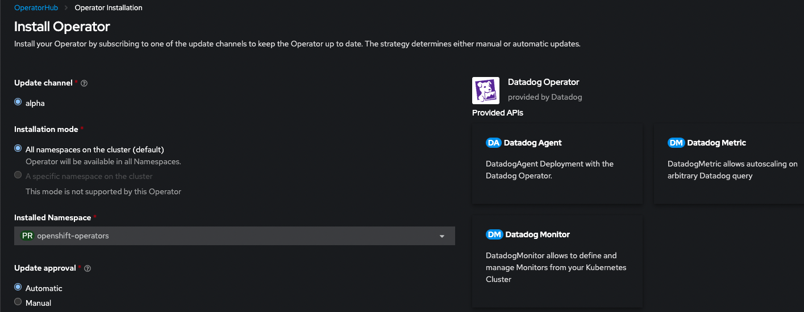

## Overview

The Datadog Operator is [certified by RedHat's Marketplace][1].

## Deploy the Datadog Operator in an OpenShift cluster

Use the [Operator Lifecycle Manager][2] to deploy the Datadog Operator from OperatorHub in your OpenShift Cluster web console.

1. You can create a `datadog` project in your OpenShift cluster:

   ```shell
   oc new-project datadog
   ```

2. In OperatorHub or the OpenShift Web Console, search for the Datadog Operator and click **Install**.


Installation includes the creation of a `ServiceAccount` called `datadog-agent-scc` that is bound to two default OpenShift `SecurityContextConstraints`.

3. Specify the namespace to install the Datadog Operator in, you can use `datadog` if you previously created the project or an existing one, such as `openshift-operators`:



**Note**: Prior to version 1.0, multiple `InstallModes` were supported in the `ClusterServiceVersion` (see the [OLM operator install doc][3] as a reference). Due to the introduction of the conversion webhook in 1.0, only the `AllNamespaces` `InstallMode` [is supported][4] in versions 1.0 and later.

## Deploy the Datadog Agent with the Operator

After deploying the Datadog Operator, create a `DatadogAgent` resource that triggers a deployment of the Datadog Agent in your OpenShift cluster. The Agent is deployed as a `Daemonset`. Datadog recommends that you use the Cluster Agent to manage cluster-level monitoring, which will automatically be deployed by default.


**Notes**:
- In Datadog Operator versions `1.1` and later, the conversion webhook is **disabled** by default. To enable the webhook, use the command argument `--webhookEnabled`.
- In Datadog Operator version `1.0`, listing the conversion webhook is **enabled** by default. The conversion allows a smooth transition from the (deprecated) `v1alpha1` `DatadogAgent` CRD to `v2alpha1`.


1. Create a Kubernetes secret with your API and App keys:

   ```shell
   oc create secret generic datadog-secret -n datadog --from-literal api-key=<DATADOG_API_KEY> --from-literal app-key=<DATADOG_APP_KEY>
   ```
   Replace `<DATADOG_API_KEY>` and `<DATADOG_APP_KEY>` with your [Datadog API][5] and [Application keys][6].


2. Create a file with the manifest of your `DatadogAgent` deployment.

The following is the simplest recommended configuration for the `DatadogAgent` in OpenShift:

  ```yaml
  apiVersion: datadoghq.com/v2alpha1
  kind: DatadogAgent
  metadata:
    name: datadog
    namespace: datadog # or openshift-operators depending on where the Datadog Operator was deployed
  spec:
    global:
      credentials:
        apiSecret:
          keyName: api-key
          secretName: datadog-secret
        appSecret:
          keyName: app-key
          secretName: datadog-secret
      criSocketPath: /var/run/crio/crio.sock
      kubelet:
        # This is needed if the kubelet certificate is self-signed.
        # Alternatively, the CA certificate used to create the kubelet certificate can be mounted.
        tlsVerify: false
    override:
      nodeAgent:
        hostNetwork: true # In OpenShift 4.0+, set this parameter to get host tags and aliases
        securityContext:
          runAsUser: 0
          seLinuxOptions:
            level: s0
            role: system_r
            type: spc_t
            user: system_u
        serviceAccountName: datadog-agent-scc
      clusterAgent:
        serviceAccountName: datadog-agent-scc
        replicas: 2
  ```

Setting the `serviceAccountName` in the `nodeAgent` and `clusterAgent` `override` section ensures that these pods are associated with the necessary `SecurityContextConstraints` and RBACs.

3. Apply the Datadog Agent manifest:
   ```shell
   oc apply -f path/to/your/datadog-agent.yaml
   ```

The Datadog Agent and Cluster Agent should now be running and collecting data. This data can be viewed and alerted on in the Datadog web app.

[1]: https://catalog.redhat.com/software/operators/detail/5e9874986c5dcb34dfbb1a12#deploy-instructions
[2]: https://olm.operatorframework.io/
[3]: https://olm.operatorframework.io/docs/tasks/install-operator-with-olm/
[4]: https://olm.operatorframework.io/docs/advanced-tasks/adding-admission-and-conversion-webhooks/#conversion-webhook-rules-requirements
[5]: https://app.datadoghq.com/organization-settings/api-keys
[6]: https://app.datadoghq.com/organization-settings/application-keys
