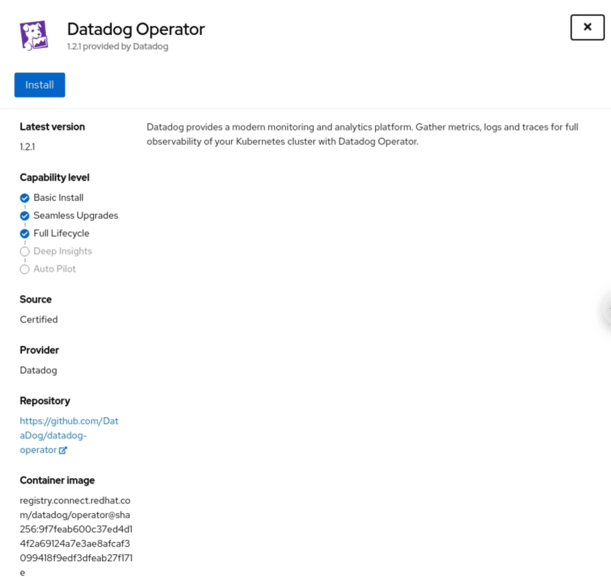

# Installation

The Datadog Operator is [certified by RedHat's Marketplace][1].

## Deploy the Datadog Operator

To deploy the Datadog Operator in an OpenShift cluster we recommend using the [Operator Lifecycle Manager][2], deploying the operator directly from the OperatorHub in your OpenShift cluster Web Console.

1. Create a new `datadog` project in your OpenShift cluster:

   ```shell
   oc new-project datadog
   ```
1. In OperatorHub, in the OpenShift Web Console, search of the Datadog Operator and click Install:



1. In the Install options, select “datadog” as the Installed Namespace:


## Deploy the Datadog Agents with the operator

After deploying the Datadog Operator, create the `DatadogAgent` resource that triggers the Datadog Agent's deployment in your OpenShift cluster. By creating this resource, the Agent will be deployed as a `DaemonSet` on every `Node` of your cluster.

1. Create a Kubernetes secret with your API and APP keys

   ```shell
   kubectl create secret generic datadog-secret -n datadog --from-literal api-key=<DATADOG_API_KEY> --from-literal app-key=<DATADOG_APP_KEY>
   ```
   Replace `<DATADOG_API_KEY>` and `<DATADOG_APP_KEY>` with your [Datadog API and application keys][3]

1. Create a file with the spec of your DatadogAgent deployment configuration. The simplest configuration is:

   ```yaml
   apiVersion: datadoghq.com/v1alpha1
   kind: DatadogAgent
   metadata:
     name: datadog
     namespace: datadog
   spec:
     credentials:
       apiSecret:
         secretName: datadog-secret
         keyName: api-key
       appSecret:
         secretName: datadog-secret
         keyName: app-key
      agent:
        rbac:
          serviceAccountName: datadog-agent-scc
        config:
          securityContext:
            runAsUser: 0
            seLinuxOptions:
              level: s0
              role: system_r
              type: spc_t
              user: system_u
          criSocket:
            criSocketPath: /var/run/crio/crio.sock
          env:
          - name: DD_KUBELET_TLS_VERIFY
            value: "false"
   ```

1. Deploy the Datadog agent with the above configuration file:
   ```shell
   oc apply -f path/to/your/datadog-agent.yaml
   ```

The Datadog Agent will run with the service account `datadog-agent-scc` created by the Datadog Operator and connected to the right SCCs.

[1]: https://catalog.redhat.com/software/operators/detail/5e9874986c5dcb34dfbb1a12#deploy-instructions
[2]: https://olm.operatorframework.io/
[3]: https://app.datadoghq.com/organization-settings/api-keys
