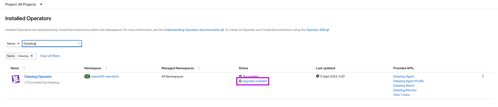

## Overview

The Datadog Operator is [certified by RedHat's Marketplace][1].

## Deploy the Datadog Operator in an OpenShift cluster

Use the [Operator Lifecycle Manager][2] to deploy the Datadog Operator from OperatorHub in your OpenShift Cluster web console.

1. In OperatorHub or the OpenShift Web Console, search for the Datadog Operator and click **Install**.


Installation includes the creation of a `ServiceAccount` called `datadog-agent-scc` that is bound to two default OpenShift `SecurityContextConstraints` (`hostaccess` and `privileged`), which are required for the Datadog Agent to run.

2. Specify the namespace to install the Datadog Operator in, you can use the default `openshift-operators` or a different existing one:


**Note**: Prior to version 1.0, multiple `InstallModes` were supported in the `ClusterServiceVersion` (see the [OLM operator install doc][3] as a reference). Due to the introduction of the conversion webhook in 1.0, only the `AllNamespaces` `InstallMode` [is supported][4] in versions 1.0 and later.

## Deploy the Datadog Agent with the Operator

After deploying the Datadog Operator, create a `DatadogAgent` resource that triggers a deployment of the Datadog Agent in your OpenShift cluster. The Agent is deployed as a `DaemonSet`. Datadog recommends that you use the Cluster Agent to manage cluster-level monitoring, which will automatically be deployed by default as an additional `Deployment`.


**Notes**:
- In Datadog Operator versions `1.1` and later, the conversion webhook is **disabled** by default. To enable the webhook, use the command argument `--webhookEnabled`.
- In Datadog Operator version `1.0`, listing the conversion webhook is **enabled** by default. The conversion allows a smooth transition from the (deprecated) `v1alpha1` `DatadogAgent` CRD to `v2alpha1`.


1. In the namespace where the Datadog Operator was deployed, create a Kubernetes secret with your API and App keys:

   ```shell
   oc create secret generic datadog-secret -n openshift-operators --from-literal api-key=<DATADOG_API_KEY> --from-literal app-key=<DATADOG_APP_KEY>
   ```
   Replace `<DATADOG_API_KEY>` and `<DATADOG_APP_KEY>` with your [Datadog API][5] and [Application keys][6].


2. Create a file with the manifest of your `DatadogAgent` deployment.

The following is the simplest recommended configuration for the `DatadogAgent` in OpenShift. Datadog recommends setting your `global.clusterName` as follows:

  ```yaml
  kind: DatadogAgent
  apiVersion: datadoghq.com/v2alpha1
  metadata:
    name: datadog
    namespace: openshift-operators # set as the same namespace where the Datadog Operator was deployed
  spec:
    features:
      apm:
        enabled: true
        hostPortConfig:
          enabled: true
        unixDomainSocketConfig:
          enabled: false
      dogstatsd:
        unixDomainSocketConfig:
          enabled: false
    global:
      credentials:
        apiSecret:
          keyName: api-key
          secretName: datadog-secret
        appSecret:
          keyName: app-key
          secretName: datadog-secret
      clusterName: <CLUSTER_NAME>
      kubelet:
        tlsVerify: false
    override:
      clusterAgent:
        serviceAccountName: datadog-agent-scc
      nodeAgent:
        serviceAccountName: datadog-agent-scc
        hostNetwork: true
        tolerations:
          - key: node-role.kubernetes.io/master
            operator: Exists
            effect: NoSchedule
          - key: node-role.kubernetes.io/infra
            operator: Exists
            effect: NoSchedule
  ```

A few notes on this configuration:

- Setting the `serviceAccountName: datadog-agent-scc` in the `nodeAgent` and `clusterAgent` `override` section ensures that these pods are associated with the necessary `SecurityContextConstraints` and RBACs managed by the OperatorHub installation.
- The Kubelet API certificates might not always be signed by cluster CA. As a result, you must disable Kubelet TLS verification.
- In OpenShift 4.0+, set the `hostNetwork` parameter to allow access to your cloud provider metadata (IMDS) API endpoint for host tags and aliases.
- If using APM or DogStatsD, disable the Unix Domain Socket (UDS) method, as this requires highly elevated privileges on your APM application pods. Disabling it also ensures that the Admission Controller does not inject this configuration. To disable APM entirely, set `features.apm.enabled` to false.

3. Apply the Datadog Agent manifest:
   ```shell
   oc apply -f path/to/your/datadog-agent.yaml
   ```

The Datadog Agent and Cluster Agent should now be running and collecting data. This data can be viewed and alerted on in the Datadog web app.


## Known issues
### Datadog Operator 1.1.0-1.4.1 on OpenShift

When upgrading from versions 1.1.0-1.4.1 of the Datadog Operator bundle provided to OperatorHub in OpenShift, the following error occurs:

```
message: 'retrying execution due to error: error validating existing CRs against new CRD''s schema for "datadogagents.datadoghq.com": error listing resources in GroupVersionResource schema.GroupVersionResource{Group:"datadoghq.com", Version:"v1alpha1", Resource:"datadogagents"}: conversion webhook for datadoghq.com/v2alpha1, Kind=DatadogAgent failed: Post "https://datadog-operator-webhook-service.openshift-operators.svc:443/convert?timeout=30s": no endpoints available for service "datadog-operator-webhook-service"'
```

#### Background

Datadog Operator 1.0 made significant changes to the DatadogAgent CRD, and thus included a conversion webhook (enabled by default) to assist users in converting the v1alpha1 CRD version to v2alpha1. The conversion webhook is disabled by default in 1.1.0.

Datadog Operator bundles 1.1.0-1.4.1 provided to OperatorHub in OpenShift include incomplete references to the conversion pathway. As a result, in the presence of a DatadogAgent custom resource (CR), pre-flight validation by Operator Lifecycle Manager attempts to run the conversion on the CR and then fails due to an undefined endpoint, as seen in the error message.

#### Resolution

This issue is resolved in Datadog Operator bundle 1.4.2+. Use the OperatorHub UI to uninstall the Datadog Operator and reinstall 1.4.2+. Do not delete the DatadogAgent resource.

For further help, contact [Datadog Support][7].


### Datadog Operator 1.8.0 on OpenShift


When upgrading from versions <1.8.0 to Datadog Operator 1.8.0 of the Datadog Operator bundle provided to OperatorHub in OpenShift, one may encounter an error in the `InstallPlan` and/or `ClusterServiceVersion` resource:
```
Message: Risk of data loss updating "datadogagents.datadoghq.com": new CRD removes version v1alpha1 that is listed as a stored version on the existing CRD
```

#### Background

Datadog Operator bundle 1.8.0 includes the removal of the deprecated `v1alpha1` CRD version. If an older bundle installation stored this version in the DatadogAgent CRD `status` field, the Operator Lifecycle Manager automatically prevents the upgrade from completing. For more details, see [Removing an old version][8] from the Kubernetes Custom Resources documentation.

#### Identification and remediation
You can identify whether or not you are impacted by running:
```bash
oc get customresourcedefinitions datadogagents.datadoghq.com -osjon | jq .status.storedVersions
```

* If the returned array contains the entry `v1alpha1`, you are impacted and should follow the rest of this guide. There are **two different courses of action**, depending on whether or not the upgrade was attempted.
* If not, ignore this guide and proceed with the installation/upgrade as usual.

**Note**: During these steps, the Datadog Agents will keep running, ensuring your observability is not disrupted.

##### Scenario 1: Presence of v1alpha1 CRD confirmed before upgrading to 1.8.0

1. Remove `v1alpha1` from the DatadogAgent CRD: `oc patch customresourcedefinitions datadogagents.datadoghq.com --subresource='status' --type='merge' -p '{"status":{"storedVersions":["v2alpha1"]}}'`
2. Proceed with the upgrade as usual from the OperatorHub UI.

##### Scenario 2: Presence of v1alpha1 CRD confirmed after attempting to upgrade to 1.8.0

1. Remove `v1alpha1` from the DatadogAgent CRD: `oc patch customresourcedefinitions datadogagents.datadoghq.com --subresource='status' --type='merge' -p '{"status":{"storedVersions":["v2alpha1"]}}'`
2. Remove both `ClusterServiceVersion` resources (current and failed upgrade): `oc delete csv datadog-operator.v1.7.0 datadog-operator.v1.8.0`
3. Remove the status from the `Subscription` to force a new reconciliation: `oc patch sub <subscription name> --subresource='status' --type='json' -p='[{"op": "remove", "path": "/status"}]'`
4. A new `ClusterServiceVersion` should automatically be created (identical to the one preceding the upgrade). Depending on the `installPlanApproval` configuration, you may need to approve the `InstallPlan`.
5. Proceed with the upgrade as usual from OperatorHub.


[1]: https://catalog.redhat.com/software/operators/detail/5e9874986c5dcb34dfbb1a12#deploy-instructions
[2]: https://olm.operatorframework.io/
[3]: https://olm.operatorframework.io/docs/tasks/install-operator-with-olm/
[4]: https://olm.operatorframework.io/docs/advanced-tasks/adding-admission-and-conversion-webhooks/#conversion-webhook-rules-requirements
[5]: https://app.datadoghq.com/organization-settings/api-keys
[6]: https://app.datadoghq.com/organization-settings/application-keys
[7]: https://www.datadoghq.com/support/
[8]: https://kubernetes.io/docs/tasks/extend-kubernetes/custom-resources/custom-resource-definition-versioning/
