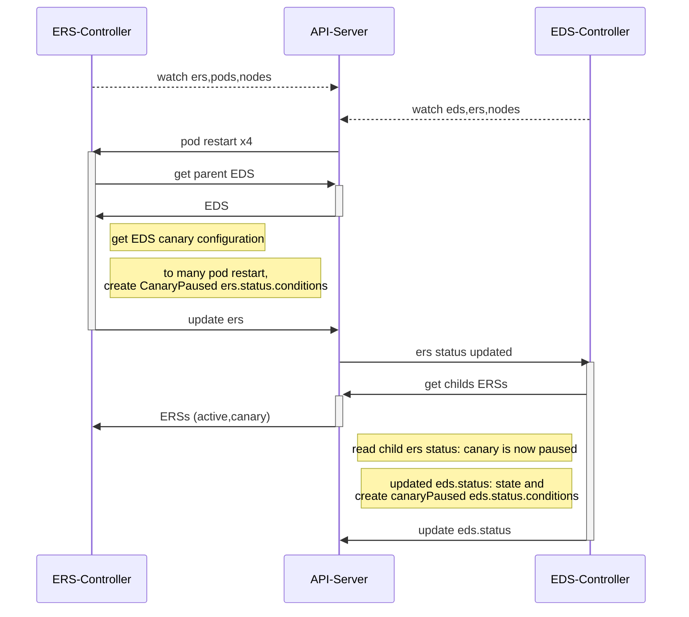
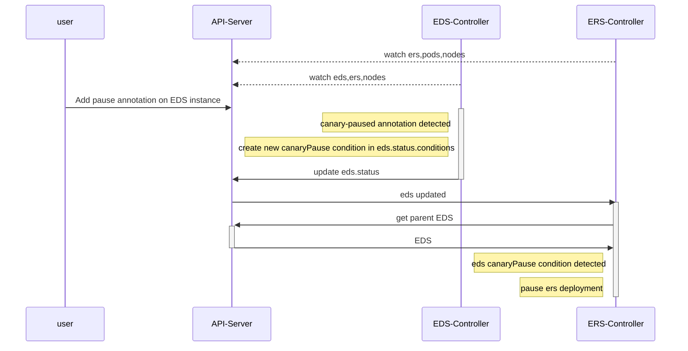
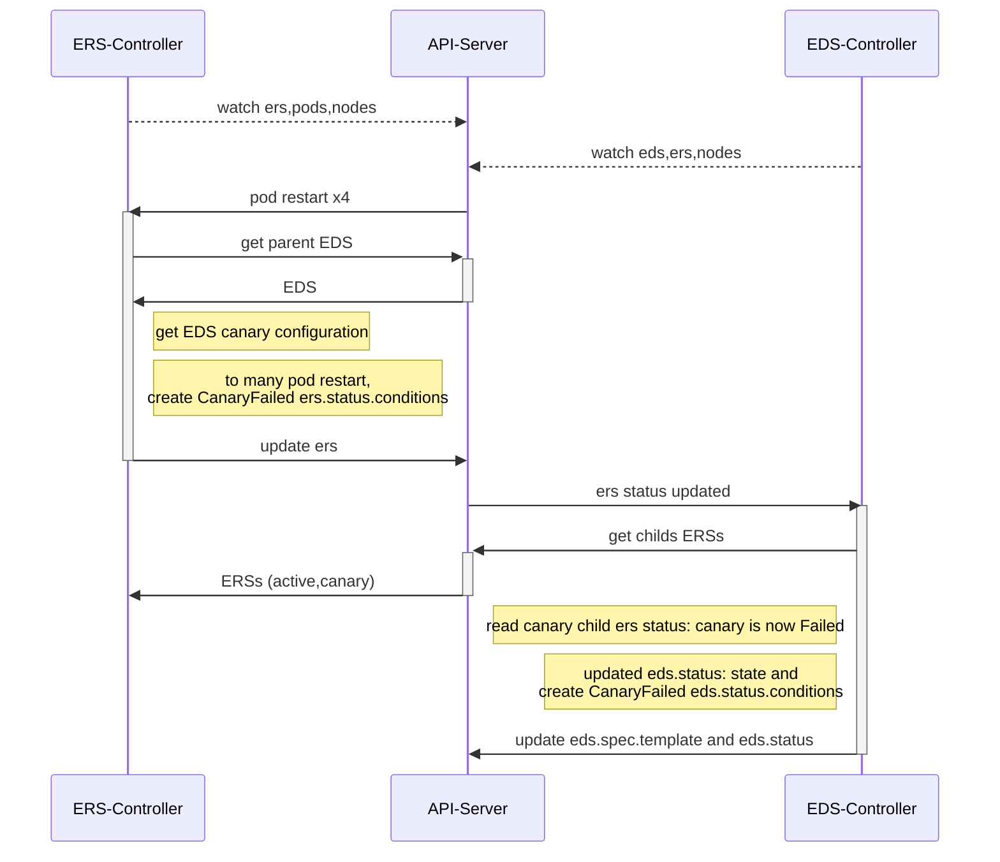

# reconcile loops interactions

The ExtendedDaemonset controller is composed with 3 different reconcile loops; One by CRD:

* ExtendedDaemonset
* ExtendedDaemonsetReplicaset
* ExtendedDaemonsetSettings

The differents reconcile loops need some time to interact together. To do so, some of them are watching events happening on the other CRDs, But only the CRD managed by the reconcile loop can modify the CRD. All the other CRDs could be read but never updated.

The following sections explain these interactions depending on the cases.

## Automatic canary pause

When the user has configured the canary auto-pause feature. The following sequence diagram explains the interactions between reconciling loops when the ERS reconcile loop detects that the auto-pause conditions have been reached.

![sequence diagram](https://mermaid.ink/img/eyJjb2RlIjoic2VxdWVuY2VEaWFncmFtXG4gICAgcGFydGljaXBhbnQgZXJzIGFzIEVSUy1Db250cm9sbGVyXG4gICAgcGFydGljaXBhbnQgYXBpIGFzIEFQSS1TZXJ2ZXJcbiAgICBwYXJ0aWNpcGFudCBlZHMgYXMgRURTLUNvbnRyb2xsZXJcblxuICAgIGVycy0tPj5hcGk6IHdhdGNoIGVycyxwb2RzLG5vZGVzXG4gICAgZWRzLS0-PmFwaTogd2F0Y2ggZWRzLGVycyxub2Rlc1xuXG4gICAgYXBpLT4-ZXJzOiBwb2QgcmVzdGFydCB4NFxuICAgIGFjdGl2YXRlIGVyc1xuICAgIGVycy0-PithcGk6IGdldCBwYXJlbnQgRURTXG4gICAgYXBpLT4-LWVyczogRURTXG4gICAgTm90ZSByaWdodCBvZiBlcnM6IGdldCBFRFMgY2FuYXJ5IGNvbmZpZ3VyYXRpb25cbiAgICBOb3RlIHJpZ2h0IG9mIGVyczogdG8gbWFueSBwb2QgcmVzdGFydCw8YnIvPiAgY3JlYXRlIENhbmFyeVBhdXNlZCBlcnMuc3RhdHVzLmNvbmRpdGlvbnNcbiAgICBlcnMtPj5hcGk6IHVwZGF0ZSBlcnNcbiAgICBkZWFjdGl2YXRlIGVyc1xuXG4gICAgYXBpLT4-ZWRzOiBlcnMgc3RhdHVzIHVwZGF0ZWRcbiAgICBhY3RpdmF0ZSBlZHNcbiAgICBlZHMtPj4rYXBpOiBnZXQgY2hpbGRzIEVSU3NcbiAgICBhcGktPj4tZXJzOiBFUlNzIChhY3RpdmUsY2FuYXJ5KVxuICAgIE5vdGUgbGVmdCBvZiBlZHM6IHJlYWQgY2hpbGQgZXJzIHN0YXR1czogY2FuYXJ5IGlzIG5vdyBwYXVzZWRcbiAgICBOb3RlIGxlZnQgb2YgZWRzOiB1cGRhdGVkIGVkcy5zdGF0dXM6IHN0YXRlIGFuZCA8YnIvPiBjcmVhdGUgY2FuYXJ5UGF1c2VkIGVkcy5zdGF0dXMuY29uZGl0aW9uc1xuICAgIGVkcy0-PmFwaTogdXBkYXRlIGVkcy5zdGF0dXNcbiAgICBkZWFjdGl2YXRlIGVkcyIsIm1lcm1haWQiOnsidGhlbWUiOiJkZWZhdWx0In0sInVwZGF0ZUVkaXRvciI6ZmFsc2V9)

## User adds a pause annotation on a EDS instance

The following diagram represents the usecase when the user adds a canary pause annotation on top of the EDS instance.

![Sequence Diagram](https://mermaid.ink/img/eyJjb2RlIjoic2VxdWVuY2VEaWFncmFtXG4gICAgcGFydGljaXBhbnQgdXNlciBhcyB1c2VyXG4gICAgcGFydGljaXBhbnQgYXBpIGFzIEFQSS1TZXJ2ZXJcbiAgICBwYXJ0aWNpcGFudCBlZHMgYXMgRURTLUNvbnRyb2xsZXJcbiAgICBwYXJ0aWNpcGFudCBlcnMgYXMgRVJTLUNvbnRyb2xsZXJcbiAgICBcblxuICAgIGVycy0tPj5hcGk6IHdhdGNoIGVycyxwb2RzLG5vZGVzXG4gICAgZWRzLS0-PmFwaTogd2F0Y2ggZWRzLGVycyxub2Rlc1xuXG4gICAgdXNlci0-PmFwaTogQWRkIHBhdXNlIGFubm90YXRpb24gb24gRURTIGluc3RhbmNlXG4gICAgYWN0aXZhdGUgZWRzXG4gICAgTm90ZSBsZWZ0IG9mIGVkczogY2FuYXJ5LXBhdXNlZCBhbm5vdGF0aW9uIGRldGVjdGVkXG4gICAgTm90ZSBsZWZ0IG9mIGVkczogY3JlYXRlIG5ldyBjYW5hcnlQYXVzZSBjb25kaXRpb24gaW4gZWRzLnN0YXR1cy5jb25kaXRpb25zXG4gICAgZWRzLT4-YXBpOiB1cGRhdGUgZWRzLnN0YXR1c1xuICAgIGRlYWN0aXZhdGUgZWRzXG4gICAgYXBpLT4-ZXJzOiBlZHMgdXBkYXRlZFxuICAgIGFjdGl2YXRlIGVyc1xuICAgIGVycy0-PithcGk6IGdldCBwYXJlbnQgRURTXG4gICAgYXBpLT4-LWVyczogRURTXG4gICAgTm90ZSBsZWZ0IG9mIGVyczogZWRzIGNhbmFyeVBhdXNlIGNvbmRpdGlvbiBkZXRlY3RlZFxuICAgIE5vdGUgbGVmdCBvZiBlcnM6IHBhdXNlIGVycyBkZXBsb3ltZW50XG4gICAgZGVhY3RpdmF0ZSBlcnMiLCJtZXJtYWlkIjp7InRoZW1lIjoiZGVmYXVsdCJ9LCJ1cGRhdGVFZGl0b3IiOmZhbHNlfQ)

## Automatic canary failed

Very similar to the "Automatic canary pause". The "auto-failed" functionality reverts the EDS instance configuration to stop the Canary phase. To do so, the ExtendedDaemonset reconcile loop is updated the `EDS.Spec.Template` with the "Active" `ExtendedDaemonsetReplicaset.spec.Template`.

![Sequence Diagram](https://mermaid.ink/img/eyJjb2RlIjoic2VxdWVuY2VEaWFncmFtXG4gICAgcGFydGljaXBhbnQgZXJzIGFzIEVSUy1Db250cm9sbGVyXG4gICAgcGFydGljaXBhbnQgYXBpIGFzIEFQSS1TZXJ2ZXJcbiAgICBwYXJ0aWNpcGFudCBlZHMgYXMgRURTLUNvbnRyb2xsZXJcblxuICAgIGVycy0tPj5hcGk6IHdhdGNoIGVycyxwb2RzLG5vZGVzXG4gICAgZWRzLS0-PmFwaTogd2F0Y2ggZWRzLGVycyxub2Rlc1xuXG4gICAgYXBpLT4-ZXJzOiBwb2QgcmVzdGFydCB4NFxuICAgIGFjdGl2YXRlIGVyc1xuICAgIGVycy0-PithcGk6IGdldCBwYXJlbnQgRURTXG4gICAgYXBpLT4-LWVyczogRURTXG4gICAgTm90ZSByaWdodCBvZiBlcnM6IGdldCBFRFMgY2FuYXJ5IGNvbmZpZ3VyYXRpb25cbiAgICBOb3RlIHJpZ2h0IG9mIGVyczogdG8gbWFueSBwb2QgcmVzdGFydCw8YnIvPiAgY3JlYXRlIENhbmFyeUZhaWxlZCBlcnMuc3RhdHVzLmNvbmRpdGlvbnNcbiAgICBlcnMtPj5hcGk6IHVwZGF0ZSBlcnNcbiAgICBkZWFjdGl2YXRlIGVyc1xuXG4gICAgYXBpLT4-ZWRzOiBlcnMgc3RhdHVzIHVwZGF0ZWRcbiAgICBhY3RpdmF0ZSBlZHNcbiAgICBlZHMtPj4rYXBpOiBnZXQgY2hpbGRzIEVSU3NcbiAgICBhcGktPj4tZXJzOiBFUlNzIChhY3RpdmUsY2FuYXJ5KVxuICAgIE5vdGUgbGVmdCBvZiBlZHM6IHJlYWQgY2FuYXJ5IGNoaWxkIGVycyBzdGF0dXM6IGNhbmFyeSBpcyBub3cgRmFpbGVkXG4gICAgTm90ZSBsZWZ0IG9mIGVkczogdXBkYXRlZCBlZHMuc3RhdHVzOiBzdGF0ZSBhbmQgPGJyLz4gY3JlYXRlIENhbmFyeUZhaWxlZCBlZHMuc3RhdHVzLmNvbmRpdGlvbnNcbiAgICBlZHMtPj5hcGk6IHVwZGF0ZSBlZHMuc3BlYy50ZW1wbGF0ZSBhbmQgZWRzLnN0YXR1c1xuICAgIGRlYWN0aXZhdGUgZWRzIiwibWVybWFpZCI6eyJ0aGVtZSI6ImRlZmF1bHQifSwidXBkYXRlRWRpdG9yIjpmYWxzZX0)

